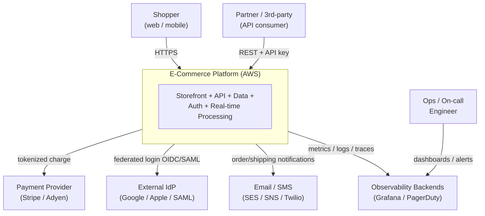
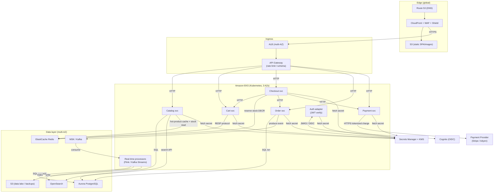
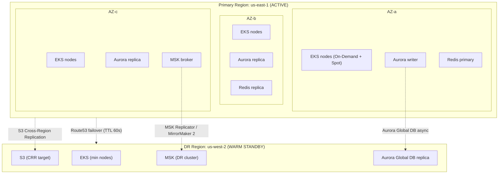
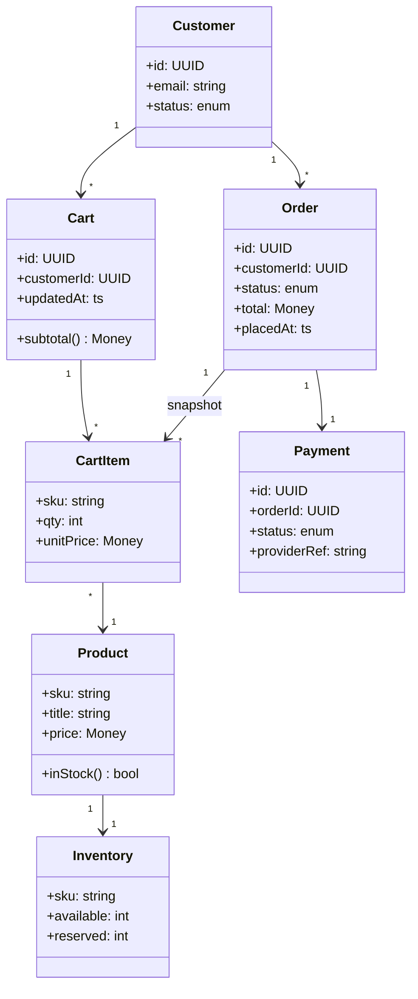
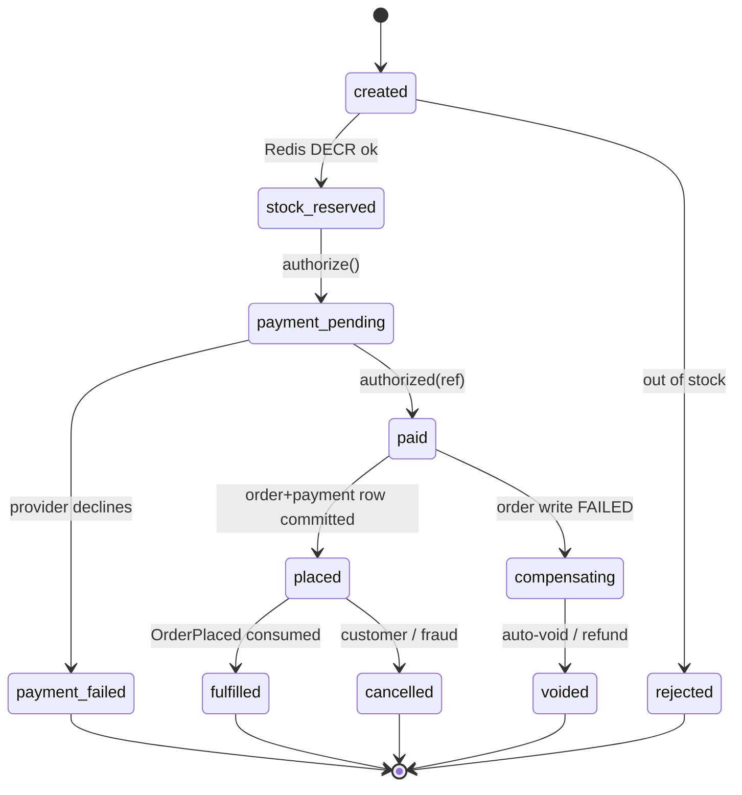
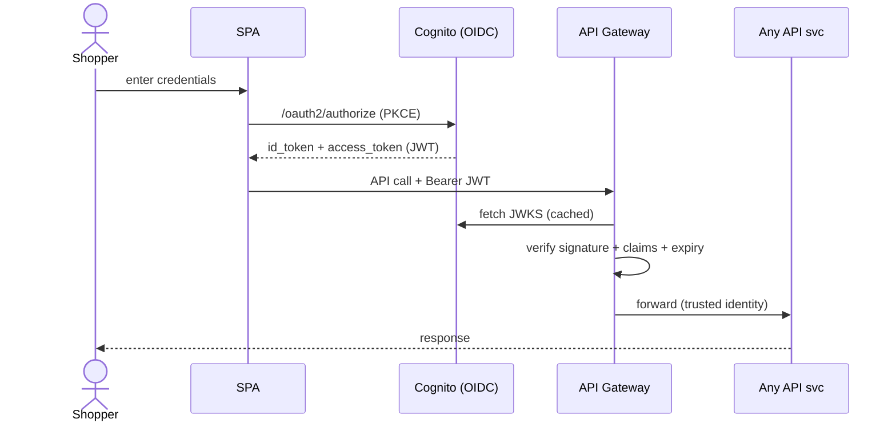
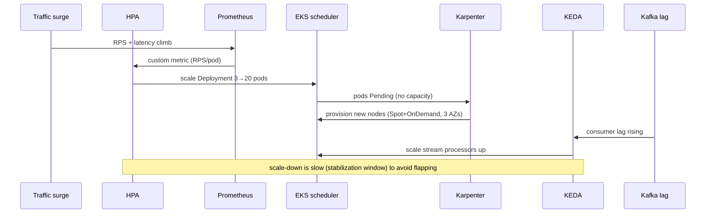

# High Level Solution Design — Cloud-Native E-Commerce Platform

> Follows the **Genesis High Level Solution Design Document Template** (Confluence
> `NNGA/969900033`). This is a **greenfield reference architecture** — diagrams are
> design-level (target state), not reverse-engineered from existing code. Primary
> cloud is **AWS**; every core building block is anchored on an open standard so the
> platform can be re-hosted on GCP/Azure with bounded effort.
>
> Companion documents: [`README.md`](./README.md) (submission entry point / summary) ·
> **▶ [`architecture-deck.html`](./architecture-deck.html) — open the architecture slide deck**
> (real AWS icons, animated runtime flows, layered container view, data-store explainer, risks —
> self-contained, opens on a double-click).

---

# 1. Overview or Introduction

The purpose of this design is to define a **production-ready, cloud-native e-commerce
platform** capable of serving a high-traffic online storefront with strong guarantees
around **high availability, horizontal scalability, disaster recovery, and security**,
while **deliberately minimizing vendor lock-in**.

The platform comprises five mandatory capabilities:

1. **Web Front End** — the customer-facing storefront (browse, search, cart, checkout).
2. **RESTful API Backend** — the business logic (catalog, cart, orders, payments).
3. **Database** — the transactional source of truth plus cache and search.
4. **Authentication Service** — customer identity, login, token issuance (OIDC).
5. **Real-time Data Processing** — event-driven inventory, fraud scoring, analytics.

*Epic / stories links: TBD — link the delivery epic and stories here once tracked in Jira.*

## 1.1. Terms & Definitions

| Term | Acronym | Definition | Comment |
|------|---------|------------|---------|
| Availability Zone | AZ | An isolated datacenter within a cloud region | We span 3 AZs |
| High Availability | HA | System stays operational despite component failure | Multi-AZ design |
| Disaster Recovery | DR | Recovery of service after a region-level failure | Warm standby, cross-region |
| Recovery Point Objective | RPO | Max acceptable data loss (time) | Target < 1 min |
| Recovery Time Objective | RTO | Max acceptable downtime to restore service | Target < 15 min |
| Horizontal Pod Autoscaler | HPA | Kubernetes controller that scales pod replicas | Scales on CPU/mem/custom metrics |
| Cluster Autoscaler / Karpenter | — | Scales the number/size of worker nodes | Karpenter for right-sizing |
| Kubernetes Event-Driven Autoscaler | KEDA | Scales workloads on external event metrics | Scales on Kafka consumer lag |
| Content Delivery Network | CDN | Edge cache network for low-latency asset delivery | CloudFront |
| Web Application Firewall | WAF | Filters malicious HTTP traffic at the edge | AWS WAF |
| OpenID Connect | OIDC | Identity layer on top of OAuth 2.0 | Auth standard we speak |
| JSON Web Token | JWT | Signed token carrying identity/claims | Validated by services |
| Managed Streaming for Kafka | MSK | AWS-managed Apache Kafka | Event backbone |
| Service Level Objective | SLO | Target reliability level (e.g. 99.9%) | Drives alerting |
| Infrastructure as Code | IaC | Infrastructure defined declaratively in source | Terraform |
| Identity for Service Accounts | IRSA | Per-pod IAM roles on EKS | Least privilege |

## 1.2. Problem Statement

- E-commerce traffic is **highly variable** — flash sales, product drops, and seasonal
  peaks (Black Friday) can drive 10–50× baseline load in minutes. A statically
  provisioned system either wastes money at baseline or falls over at peak.
- **Downtime is directly lost revenue.** A checkout outage during a peak event is a
  business-critical incident, so single points of failure (single AZ, single region,
  single database) are unacceptable.
- **Monolithic coupling** makes a failure in a non-critical feature (reviews,
  recommendations) capable of taking down the critical path (checkout).
- **Vendor lock-in** to one cloud's proprietary services raises long-term cost and
  migration risk, and weakens negotiating position.
- **Security & compliance** — handling customer PII and payment flows demands
  defense-in-depth, encryption everywhere, and least-privilege access by default.

## 1.3. Solution Statement

A set of **containerized microservices on Kubernetes (EKS)**, fronted by a **CDN
(CloudFront)** and **API Gateway**, backed by a **multi-AZ managed data layer**
(Aurora PostgreSQL, ElastiCache Redis, OpenSearch) and an **event backbone (Kafka/MSK)**
that powers real-time processing. Identity is handled by **Cognito over open OIDC**.
The whole stack is **multi-AZ for HA**, **warm-standby multi-region for DR**,
**auto-scaled at three layers** (pods, nodes, event consumers), and **observable**
end-to-end via OpenTelemetry. Portability is preserved by anchoring every core
component on an open standard (Kubernetes, PostgreSQL, Redis, Kafka, OIDC, S3 API,
OpenTelemetry, Terraform).

---

# 2. Requirement Summary

**Functional**
- Serve a storefront: browse catalog, faceted search, product detail, cart, checkout, order history.
- Expose a versioned RESTful API for web/mobile clients and partners.
- Authenticate customers (email/password, social, MFA) and issue standard tokens.
- Process orders transactionally; integrate with an external tokenizing payment provider.
- Process events in near real-time: inventory decrement, fraud scoring, personalization signals, analytics.

**Non-functional**
| Attribute | Target |
|-----------|--------|
| Availability (checkout path) | ≥ 99.95% (multi-AZ), SLO 99.9% |
| Latency | p95 API < 300 ms; p99 checkout < 800 ms |
| Scalability | 10–50× baseline within minutes (flash sale) |
| RPO / RTO | RPO < 1 min under normal replication lag (worst case = lag at time of failure); RTO < 15 min |
| Security | Encryption in transit + at rest; least-privilege IAM; WAF/DDoS at edge; PCI scope minimized |
| Portability | No proprietary interface in the stateful/application core |

**Users / load**
- Public internet shoppers (anonymous browse + authenticated checkout), mobile apps, and partner API consumers.
- Read-heavy (browse/search) with sharp write bursts (checkout during sales). The CDN and Kafka absorb the read load and write bursts respectively.

---

# 3. Assumptions and Prerequisites

- A single cloud org/account structure (multi-account: prod, staging, dev, security/log-archive) exists or will be provisioned.
- Payment card data is handled by an external **PCI-DSS certified tokenizing provider** (Stripe/Adyen); we never store raw PAN — this keeps our PCI scope minimal.
- The front end is a **static SPA/SSR bundle** (React/Next.js) deployable to object storage + CDN.
- All infrastructure is provisioned via **Terraform**; deployments via **GitOps (ArgoCD/Flux)** — no click-ops in production.
- Teams own services end-to-end (you build it, you run it); each service has a runbook.
- **Milestone 1** (this design's focus): single primary region, multi-AZ HA, warm-standby DR, core five capabilities. **Milestone 2** (future): multi-region active-active, service mesh, progressive delivery — tracked as future epics (see §5 and README §11).
- *Tech-debt note:* until the service mesh (M2) lands, mTLS between services relies on TLS at the ALB/ingress plus network policies rather than automatic sidecar mTLS. Link future RFR here.

---

# 4. High-Level Design

## 4.1. Architectural Plan

### 4.1.1 System Context (C4 Level 1)

Shows the platform boundary, the people who use it, and the external systems it depends on.



**ASCII fallback**

```
   Shopper (web/mobile)      Partner (API)         Ops / On-call
          │ HTTPS                │ REST+key             │ dashboards
          ▼                      ▼                      ▼
   ┌──────────────────────────────────────────────┐   ┌───────────┐
   │        E-Commerce Platform (AWS)              │──▶│ Grafana / │
   │  Storefront + API + Data + Auth + Real-time   │   │ PagerDuty │
   └───────┬───────────────┬───────────────┬───────┘   └───────────┘
           │ charge        │ federated     │ notify
           ▼               ▼ login         ▼
   ┌──────────────┐ ┌──────────────┐ ┌──────────────┐
   │ Payment      │ │ External IdP │ │ Email / SMS  │
   │ (Stripe)     │ │ (Google/SAML)│ │ (SES/SNS)    │
   └──────────────┘ └──────────────┘ └──────────────┘
```

### 4.1.2 Container / Component Diagram (C4 Level 2)

Each box is a deployable unit; edges are labeled with the **call contract**.



**ASCII fallback**

```
Route53 → CloudFront(+WAF) → ALB → API Gateway
                    │                    │ HTTP
                    ▼ static             ▼
                   S3          ┌─────── EKS (3 AZs) ───────┐
                               │ Catalog  Cart  Checkout   │
                               │ Order    Payment  Auth    │
                               │ Real-time processors      │
                               └─┬────┬─────┬─────┬────┬───┘
                        SQL │  RESP│ search│ event│JWKS │
                            ▼      ▼       ▼      ▼     ▼
                        Aurora  Redis  OpenSearch MSK  Cognito
                          ▲       ▲                 │
              RT reconcile│  Checkout reserve-stock │
                          └── Real-time ◄───────────┘  → S3 data lake
             Payment ──HTTPS tokenized charge──▶ Payment Provider (Stripe/Adyen)
             Catalog ──hot-product cache + stock read──▶ Redis
             (all services → Secrets Manager + KMS for secrets/keys)
```

**Design notes (why the topology looks this way)**
- **Two ingress layers on purpose.** The **ALB** does L7 load-balancing, TLS termination, and
  path routing into the EKS ingress; **API Gateway** owns per-consumer concerns — rate limits,
  usage plans, API keys, and request/schema validation. They are complementary, not redundant.
- **"Database-per-service" is logical, not physical.** Services own **separate schemas / tables
  within the one Aurora cluster** (no cross-service table access); it does not mean a separate
  Aurora cluster per service. Cross-service data flows via REST or Kafka events.
- **Catalog reads stock** (Redis reservation counter, backed by Aurora) to show availability on
  the storefront; the real-time processor is the writer of the authoritative decrement.
- **Payment is stateless.** It calls the external provider and returns an authorization
  reference; the **payment row is written by Order** in the same Aurora transaction as the order
  (never a separate write by Payment — avoids dual-write).
- **Checkout reserves stock synchronously in Redis** (`DECR stock:{sku}`) before charging, so
  oversell is prevented on the hot path; Aurora is reconciled asynchronously (see §4.1.4 / §4.3).

**Service-to-service call contracts**

| Caller | Callee | Mechanism | Returns / error behavior |
|--------|--------|-----------|--------------------------|
| API Gateway | Any service | HTTP/JSON (REST) | 2xx/4xx/5xx; gateway throttles + validates schema |
| Checkout | Cart | HTTP/JSON | cart snapshot; ret/timeout → circuit-breaker fallback |
| Checkout | Redis | RESP (`DECR`/`INCR`) | atomic stock reservation; negative → reject as out-of-stock |
| Checkout | Payment | HTTP/JSON | auth result; failure → order marked `payment_failed`, no charge |
| Checkout | Order | HTTP/JSON | order id; **failure after charge → auto-void/refund** (§4.3.1 compensation) |
| Payment | Payment Provider | HTTPS (tokenized) | authorization ref; provider is the external card handler |
| Order | Aurora | PostgreSQL driver (txn) | committed order+payment row; failure → rollback |
| Order | MSK | Kafka producer (async) | ack; on broker unavail → local outbox + retry |
| Any svc | Cognito | OIDC/JWKS over HTTPS | public keys cached; validate JWT signature+claims |
| Real-time | Aurora/OpenSearch/S3 | driver / bulk API | idempotent upserts (replay-safe); reconciles stock |

### 4.1.3 Deployment Diagram (regions, AZs, nodes)



**ASCII fallback**

```
PRIMARY us-east-1 (ACTIVE)                    DR us-west-2 (WARM)
┌─ AZ-a ─┐ ┌─ AZ-b ─┐ ┌─ AZ-c ─┐             ┌───────────────────┐
│EKS node│ │EKS node│ │EKS node│             │ EKS (min nodes)   │
│Aurora W│ │Aurora R│ │Aurora R│             │ Aurora Global rep │
│Redis P │ │Redis R │ │MSK     │             │ S3 (CRR target)   │
└────────┘ └────────┘ └────────┘             │ MSK (DR cluster)  │
                                             └───────────────────┘
      Aurora Global DB (async) ───────────────────────▲
      S3 Cross-Region Replication ───────────────────▲
      MSK Replicator / MirrorMaker 2 ─────────────────▲
      Route 53 health-check failover (TTL 60s) ───────▲
```

**Design notes**
- **RPO is not "zero".** Aurora Global DB and S3 CRR replicate **asynchronously**, so worst-case
  data loss = the replication lag at the instant of failure (which grows during flash-sale write
  bursts). State it as **< 1 min under normal lag; worst case = lag at time of failure**, and
  **monitor + alert on replication lag** so the real RPO is observable.
- **MSK now has a DR story.** Previously Aurora and S3 replicated cross-region but MSK did not —
  since every state change flows through Kafka, failover would have landed with no event
  backbone. A **DR MSK cluster fed by MSK Replicator / MirrorMaker 2** closes that gap (fallback:
  rebuild projections from Aurora).
- **DNS failover isn't instant.** Route 53 failover is bounded by resolver caching; we assume a
  **60s record TTL**, which keeps the < 15-min RTO credible.

### 4.1.4 Domain Class Diagram



**Service interaction rules (architectural invariants)**
- **Only the Order service writes order _and payment_ rows** in Aurora, in one transaction.
  Payment is stateless (it returns an authorization ref); no other service writes those tables,
  and nothing reads them directly — cross-service reads go via API. This rules out a dual-write.
- **Cart state lives in Redis** (with async persistence); it is ephemeral and cache-like, not the source of truth.
- **Stock is reserved synchronously in Redis, reconciled asynchronously in Aurora.** On
  checkout, Checkout does an atomic `DECR stock:{sku}` in Redis and rejects the order if the
  counter would go negative — this prevents oversell on the hot path without holding a DB lock
  during a spike. The real-time processor then applies the **authoritative** decrement in Aurora
  (idempotent, from `OrderPlaced`), and a reconcile job re-seeds the Redis counters from Aurora
  to correct any drift. (Aurora stays the source of truth; Redis is the fast admission gate.)
- **Every state change publishes an event to Kafka**; downstream consumers are the only writers to their own projections (search index, analytics, fraud store).
- **No service calls another service's database.** "Database-per-service" here is **logical** —
  each service owns its own **schemas/tables within the single Aurora cluster**, not a separate
  cluster. Cross-service data is obtained via REST or via Kafka events.
- The **Inventory ↔ Order** relationship is intentionally *not* a direct class association: the
  decrement is event-driven (via `OrderPlaced`), so the two are coupled through Kafka, not a FK.

## 4.2. Application Modules

**Core components**
- **Front end (SPA/SSR):** React/Next.js; static bundle on S3 + CloudFront; SSR pods on EKS for SEO-critical pages.
- **API Gateway:** rate limiting, throttling, request/schema validation, API keys/usage plans.
- **Microservices (EKS):** Catalog, Cart, Checkout (orchestrator), Order, Payment, Auth adapter, Real-time processors.

**User interface & layers** — presentation (SPA), edge (CDN/WAF), ingress (ALB/API GW), application (services), data (stores), eventing (Kafka).

**Database layer**
- Aurora PostgreSQL — transactional source of truth (orders, payments, customers, products).
- ElastiCache Redis — sessions, cart, hot-product cache.
- OpenSearch — catalog/faceted search projection.
- S3 — object storage, backups, analytics data lake.

**Business logic modules** — checkout orchestration, order state machine (below),
**inventory reservation via atomic Redis counters** (sync `DECR` on checkout, async Aurora
reconcile — see §4.1.4), fraud scoring (stream), personalization signals (stream).

**Order state machine** — the order lifecycle is explicit because it drives correctness,
including the compensation path (§4.3.1):



**ASCII fallback**

```
[created] ──DECR ok──▶ [stock_reserved] ──authorize──▶ [payment_pending]
    │ out of stock                                        │           │
    ▼                                          declines   │           │ authorized
[rejected]                                  [payment_failed]          ▼
                                                                    [paid]
                          order write FAILED ┌───────────────────────┤ committed
                                             ▼                        ▼
                                     [compensating]               [placed] ──▶ [fulfilled]
                                             │ auto-void/refund        │ cancel
                                             ▼                         ▼
                                         [voided]                  [cancelled]
```

**APIs & external connections** — REST API (public/partner), OIDC to Cognito/external IdP, HTTPS to payment provider, SES/SNS for notifications, OTel export to observability.

## 4.3. Transactions and User Flows

### 4.3.1 Checkout (happy path)

```mermaid
sequenceDiagram
    actor U as Shopper
    participant CF as CloudFront
    participant GW as API Gateway
    participant CO as Checkout svc
    participant CART as Cart (Redis)
    participant PAY as Payment svc
    participant PP as Payment Provider
    participant ORD as Order svc
    participant DB as Aurora
    participant K as Kafka

    U->>CF: POST /checkout (JWT)
    CF->>GW: forward (verify JWT)
    GW->>CO: createOrder(cartId)
    CO->>CART: getCart(cartId)
    CART-->>CO: cart snapshot
    CO->>CART: DECR stock:{sku} (reserve)
    CART-->>CO: reserved (>=0) else reject
    CO->>PAY: authorize(amount, token)
    PAY->>PP: charge (tokenized)
    PP-->>PAY: authorized(ref)
    PAY-->>CO: OK(ref)
    CO->>ORD: placeOrder(snapshot, ref)
    ORD->>DB: BEGIN; INSERT order+payment; COMMIT
    DB-->>ORD: committed
    ORD->>K: publish OrderPlaced
    ORD-->>CO: orderId
    CO-->>U: 201 Created (orderId)
    Note over K: async consumers: inventory reconcile↓, fraud score, analytics, email
```

**Reserve-before-charge:** stock is reserved atomically in Redis (`DECR stock:{sku}`) *before*
the payment authorization, so a sold-out item is rejected before any money moves, and the
authoritative Aurora decrement is reconciled asynchronously by the stream consumer (§4.3.3).

**Compensation (card charged, then order write fails)**

The worst outcome is a customer charged with no order. If the Aurora write fails *after* a
successful authorization, Checkout must undo the charge and release the reservation:

```mermaid
sequenceDiagram
    participant CO as Checkout svc
    participant PAY as Payment svc
    participant PP as Payment Provider
    participant ORD as Order svc
    participant DB as Aurora
    participant CART as Cart (Redis)

    CO->>PAY: authorize(amount, token)
    PAY->>PP: charge (tokenized)
    PP-->>PAY: authorized(ref)
    PAY-->>CO: OK(ref)
    CO->>ORD: placeOrder(snapshot, ref)
    ORD->>DB: BEGIN; INSERT order+payment
    DB--xORD: write FAILS (constraint / outage)
    ORD-->>CO: 5xx (not persisted)
    Note over CO: compensating transaction
    CO->>PAY: void/refund(ref)
    PAY->>PP: void or refund authorization
    PP-->>PAY: reversed
    CO->>CART: INCR stock:{sku} (release reservation)
    CO-->>CO: mark attempt payment_failed/voided
```

**ASCII fallback**

```
Checkout│Payment│Provider│Order│Aurora│Redis
   ├─authorize─►│        │     │      │
   │        ├─charge────►│     │      │
   │        │◄─auth(ref)─┤     │      │
   │◄──OK(ref)──┤        │     │      │
   ├─placeOrder──────────►│    │      │
   │            │         ├─INSERT──►│ ✗ write FAILS
   │◄────5xx (not persisted)─┤       │
   │ ── compensating transaction ──  │
   ├─void/refund(ref)─►│    │         │
   │        ├─reverse──►│   │         │
   ├─INCR stock:{sku} (release)──────►│
   └─ mark attempt payment_failed / voided
```

**ASCII fallback**

```
Shopper│CloudFront│API GW│Checkout│Cart│Payment│Provider│Order│Aurora│Kafka
   ├─POST /checkout─►│      │        │    │       │        │     │      │
   │        ├─verify─►│      │        │    │       │        │     │      │
   │        │        ├─createOrder──►│    │       │        │     │      │
   │        │        │        ├─getCart►│  │       │        │     │      │
   │        │        │        │◄─snap──┤   │       │        │     │      │
   │        │        │        ├─DECR stock (reserve)►│      │     │      │
   │        │        │        │◄─reserved──┤  │       │      │     │      │
   │        │        │        ├─authorize─►│       │        │     │      │
   │        │        │        │        │   ├─charge►│       │     │      │
   │        │        │        │        │   │◄─auth─┤        │     │      │
   │        │        │        │◄────OK─────┤       │        │     │      │
   │        │        │        ├─placeOrder────────────────►│      │      │
   │        │        │        │        │   │       │  ├─INSERT txn►│     │
   │        │        │        │        │   │       │  │◄─commit───┤      │
   │        │        │        │        │   │       │  ├─publish OrderPlaced─►│
   │        │        │        │◄──orderId──────────────┤      │      │
   │◄─201 Created────────────┤        │    │       │        │     │      │
```

### 4.3.2 Authentication / token issuance (OIDC)



### 4.3.3 Real-time event processing

```mermaid
sequenceDiagram
    participant ORD as Order svc
    participant K as Kafka (MSK)
    participant INV as Inventory consumer
    participant FR as Fraud consumer
    participant AN as Analytics consumer
    participant DB as Aurora
    participant OS as OpenSearch
    participant S3 as S3 data lake

    ORD->>K: OrderPlaced
    par fan-out to consumer groups
        K->>INV: OrderPlaced
        INV->>DB: reconcile authoritative stock decrement (idempotent)
    and
        K->>FR: OrderPlaced
        FR->>FR: score risk; flag if suspicious
    and
        K->>AN: OrderPlaced
        AN->>S3: append event (analytics)
        AN->>OS: update trending index
    end
```

### 4.3.4 Autoscaling reaction to a traffic spike



**Cold-start caveat:** provisioning new nodes takes ~60–90 s, so the first wave of a flash sale
can arrive before capacity exists. Mitigate with a **pre-warmed / over-provisioned headroom
buffer** (extra baseline pods+nodes ahead of known events) and brief request queueing at the
edge, rather than relying on reactive scaling alone. (Tracked as a risk in §4.4.)

### 4.3.5 Region failover (DR)

```mermaid
sequenceDiagram
    participant HC as Route 53 Health Check
    participant P as Primary (us-east-1)
    participant R53 as Route 53
    participant DR as DR (us-west-2)
    participant AUR as Aurora Global DB

    HC->>P: probe endpoint
    P--xHC: unhealthy (region impaired)
    HC->>R53: mark primary down
    R53->>DR: shift traffic (DNS failover, TTL 60s)
    DR->>AUR: promote DR replica to writer
    AUR-->>DR: promoted (RPO < 1 min normal; worst case = replication lag at failure)
    DR->>DR: MSK DR cluster resumes as event backbone (fed by Replicator/MM2)
    DR->>DR: Karpenter scales EKS to full capacity
    Note over R53,DR: RTO target < 15 min; validated quarterly (game-day)
```

## 4.4. Risk and Dependencies

| Risk / Dependency | Impact | Mitigation |
|-------------------|--------|-----------|
| **External payment provider outage** | Checkout cannot complete | Circuit breaker + retry; queue orders as `payment_pending`; support secondary provider (future) |
| **Aurora writer failover** | Brief write unavailability (<30s) | Multi-AZ auto-failover; app-level retry with backoff; connection pooler (RDS Proxy) |
| **Kafka backpressure during spike** | Delayed inventory/analytics | KEDA scales consumers on lag; producers use local outbox; tiered storage retains events |
| **Cognito lock-in** | Migration cost if we leave AWS | Services trust *standard OIDC/JWKS* only → swappable to Keycloak with no app changes |
| **CloudFront config is AWS-specific** | Re-platform effort | Isolated in Terraform; caching semantics map to Cloud CDN / Front Door |
| **Inventory oversell during flash sale** | Sell stock we don't have | Atomic Redis reservation on checkout (`DECR`, reject if negative); authoritative Aurora decrement reconciled async by the stream consumer; reconcile job re-seeds counters |
| **Money charged but no order created** | Highest-severity customer harm | Compensating transaction: on order-write failure after auth, auto-void/refund the charge and release the Redis reservation (§4.3.1) |
| **Kafka / MSK has no DR** | Failover lands with no event backbone | Cross-region MSK Replicator / MirrorMaker 2 to a DR cluster; fallback = rebuild projections from Aurora |
| **Cache stampede on hot products during surge** | Thundering herd hammers Aurora | Staggered/jittered TTLs + single-flight (request-coalescing) cache refresh |
| **Autoscaling cold-start (~60–90 s)** | First spike wave arrives before capacity | Pre-warmed / over-provisioned headroom before known events + brief edge queueing |
| **Poison message blocks a consumer** | Stalled projection / lag | Dead-letter queue + alert; skip-with-retry policy; replay after fix |
| **Right-to-be-forgotten across event log + S3 lake + search index** | Legal / compliance exposure (PII) | Data-subject deletion strategy: crypto-shredding, tombstones, and bounded retention across Kafka/S3/OpenSearch |
| **DR never tested** | False confidence | Quarterly game-day drills; DR runbook; automated failover verification |
| **Duplicated domain models** across services | Drift between service schemas | Shared contract via schema registry (Avro/Protobuf on Kafka); no shared DB |
| **Secrets sprawl** | Security exposure | Secrets Manager + KMS + IRSA; no secrets in images/env/code; rotation enabled |

**Documented-vs-actual note:** This is a *target-state* design; there is no running code
to cross-check yet. When implementation begins, every claim here (retries, idempotent
consumers, transactional writes, cache invalidation) must be re-verified against source
and any drift flagged back into this section.

---

# 5. Planning

Delivery is milestone-based; convert to Jira epics/stories when scheduled.

| Phase | Scope | Status |
|-------|-------|--------|
| **M1 — Core platform** | EKS, multi-AZ data layer, 5 core services, CDN, Cognito, MSK, observability, warm-standby DR | *TBD — target date* |
| **M2 — Resilience & delivery** | Service mesh (mTLS), GitOps, progressive delivery, chaos engineering | *TBD* |
| **M3 — Multi-region active-active** | Active-active writes, geo-routing, global data strategy | *TBD* |
| **M4 — Data & ML** | Lakehouse, real-time OLAP, predictive autoscaling, personalization | *TBD* |

*Divide into AIs and Stories once committed in the sprint plan.*

---

# 6. Test Plan

*Owner: QA (Guy Peleg) + service teams.*

- **Positive:** browse → search → add-to-cart → checkout → order confirmation; login (email, social, MFA); catalog CRUD.
- **Negative:** payment declined, invalid JWT/expired token, out-of-stock at checkout, malformed API input (schema validation), rate-limit exceeded.
- **Performance / load:** flash-sale simulation (10–50× baseline); soak test; verify HPA/Karpenter/KEDA scale up and down; p95/p99 latency SLO validation.
- **Integration:** payment provider sandbox, Cognito/IdP federation, Kafka consumer end-to-end (event → inventory/search/analytics projections).
- **Resilience / recovery:** AZ-loss drill, Aurora failover, **region failover game-day** (validate RPO<1min / RTO<15min), chaos fault injection.
- **Security:** authz boundary tests, secrets access, WAF rule validation, pen-test of the checkout path.
- *Link to detailed test plan: TBD.*

---

# 7. Post-deployment

*TBD — record escaped bugs, incidents, and post-mortems here after go-live for future learning.*

---

# 8. Videos and Documentation

- Companion usage/summary doc: [`README.md`](./README.md).
- PRD / architect requirements: *TBD — link once available.*
- Design-review recordings: *TBD — move to DevOps shared Meeting space (SharePoint).*

---

*This document is the design source of truth. Infrastructure is provisioned via
Terraform and deployed via GitOps so the design and running system stay in sync.
Re-verify all runtime-behavior claims against source once implementation begins (§4.4).*
