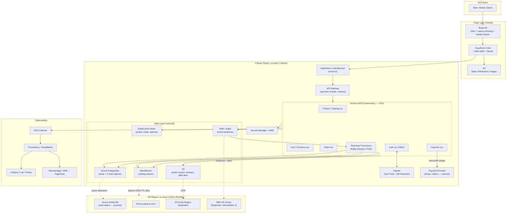

# Cloud-Native E-Commerce Platform — Architecture Design

> A production-ready reference architecture for a high-traffic e-commerce platform.
> **Primary cloud: AWS.** Designed for high availability, horizontal scalability,
> disaster recovery, and security — while deliberately minimizing vendor lock-in
> through open standards (Kubernetes, PostgreSQL, Kafka, OIDC, OpenTelemetry).
>
> **This README is the submission summary.** For the full design document — system
> context, container/component/deployment/class diagrams, and detailed sequence
> workflows (checkout, auth, real-time events, autoscaling, region failover) — see
> **[`ARCHITECTURE.md`](./ARCHITECTURE.md)** (Genesis HLD template, all architecture levels).
>
> **▶ Prefer to explore visually?** Open **[`architecture-deck.html`](./architecture-deck.html)**
> — a self-contained, keyboard-navigable slide deck of the architecture (real AWS icons,
> animated runtime flows, layered container view, data-store explainer, risks). It opens on a
> double-click (`file://`) with no server. It is the single maintained visual (earlier interactive
> explorer builds have been removed).

---

## Table of Contents

1. [Design Philosophy](#1-design-philosophy)
2. [Architecture Overview](#2-architecture-overview)
3. [Architecture Diagram](#3-architecture-diagram)
4. [Component & Service Selection](#4-component--service-selection)
5. [Resilience: HA, Scalability & Disaster Recovery](#5-resilience-ha-scalability--disaster-recovery)
6. [Scalability & Availability Strategy](#6-scalability--availability-strategy)
7. [Monitoring & Logging Strategy](#7-monitoring--logging-strategy)
8. [Security Architecture](#8-security-architecture)
9. [Avoiding Vendor Lock-In](#9-avoiding-vendor-lock-in)
10. [Design Decisions Summary](#10-design-decisions-summary)
11. [Future Enhancements](#11-future-enhancements)

---

## 1. Design Philosophy

The architecture is guided by five principles:

| Principle | How it's applied |
|-----------|------------------|
| **Portability first** | Workloads run in containers on Kubernetes (EKS). Data layer uses open engines (PostgreSQL, Redis, Kafka). Auth uses OIDC/OAuth2. Nothing core is tied to a proprietary API that can't be swapped. |
| **Fail in isolation** | Microservices, multi-AZ everything, circuit breakers, bulkheads. A failure in "reviews" must never take down "checkout". |
| **Scale horizontally** | Stateless services behind autoscalers; state pushed to managed, replicated data stores. |
| **Secure by default** | Zero-trust networking, least-privilege IAM, encryption in transit and at rest, secrets in a vault, WAF at the edge. |
| **Observable** | Every request is traced, every service emits structured logs and RED/USE metrics via OpenTelemetry. |

**Why AWS as the primary cloud?** It has the broadest managed-service catalog and
strongest multi-AZ/multi-region primitives. But every choice below names the
**open-standard equivalent** so the platform can be re-hosted on GCP or Azure with
bounded effort (see [§9](#9-avoiding-vendor-lock-in)).

---

## 2. Architecture Overview

The platform is a set of containerized microservices fronted by a CDN and API
gateway, backed by a mix of relational, cache, search, and object storage, with an
event backbone (Kafka) powering real-time processing.

**Request lifecycle (happy path):**

1. User hits the storefront → served by **CloudFront (CDN)** from **S3** (static SPA) + edge cache.
2. Dynamic/API calls route through **Route 53 → CloudFront → ALB → API Gateway** into the **EKS** cluster.
3. **Authentication service** (Cognito + OIDC-compliant fallback) validates the JWT.
4. API microservices read/write **Aurora PostgreSQL** (transactional), **ElastiCache Redis** (sessions/cart/cache), and **OpenSearch** (catalog search).
5. State-changing events (orders, inventory, clicks) are published to **MSK (Managed Kafka)**.
6. **Real-time processors** (Kafka Streams / Flink on EKS) consume events for inventory updates, fraud scoring, personalization, and analytics.
7. Everything emits telemetry to **CloudWatch + OpenTelemetry Collector → Prometheus/Grafana/Loki/Tempo**.

---

## 3. Architecture Diagram



**ASCII fallback (text-only view):**

```
                          ┌─────────────┐
        End Users ───────▶│  Route 53   │  DNS, health checks, latency routing
                          └──────┬──────┘
                                 ▼
                     ┌────────────────────────┐
                     │  CloudFront CDN + WAF   │◀── S3 (static SPA, images)
                     └───────────┬────────────┘
                                 ▼
                     ┌────────────────────────┐
                     │  ALB (multi-AZ)         │
                     │  → API Gateway          │  throttle / rate limit / schema
                     └───────────┬────────────┘
                                 ▼
   ┌───────────────────── Amazon EKS (3 AZs) ──────────────────────┐
   │  Catalog | Cart/Checkout | Order | Payment | Auth | Real-time  │
   └───┬────────┬────────┬──────────┬──────────┬───────────────────┘
       ▼        ▼        ▼          ▼          ▼
   Aurora   ElastiCache OpenSearch  MSK/Kafka  Cognito (OIDC)
   Postgres   Redis      (search)   (events)      + KMS/Secrets Mgr
   (writer+RR)
       │                              │
       │ Aurora Global DB             └─▶ Real-time processors ─▶ S3 data lake
       ▼
   Payment svc ──HTTPS tokenized charge──▶ Payment Provider (Stripe/Adyen, external)
   DR Region us-west-2 (warm standby: Aurora replica, min-scale EKS, S3 CRR,
                        MSK DR cluster via Replicator/MirrorMaker 2)

   Observability: OTel Collector → Prometheus/CloudWatch → Grafana/Loki/Tempo
                  → Alertmanager/SNS → PagerDuty
```

---

## 4. Component & Service Selection

### 4.1 Web Front End

- **Service:** React/Next.js SPA (or SSR) built to static assets, hosted on **Amazon S3** and served globally via **Amazon CloudFront**.
- **Why:** Static hosting + CDN is the cheapest, most available way to serve a front end — no servers to patch, near-infinite scale, edge caching close to users. SSR pages (for SEO on product pages) run as containers in EKS or on Lambda@Edge for personalization.
- **Portability note:** Static bundle + CDN maps 1:1 to GCP (Cloud Storage + Cloud CDN) or Azure (Blob Storage + Front Door). No proprietary lock-in.

### 4.2 RESTful API Backend

- **Service:** Containerized microservices on **Amazon EKS (Kubernetes)**, fronted by **API Gateway** and an **ALB**.
- **Why EKS over Lambda/ECS:** Kubernetes is the portability anchor — the exact same manifests/Helm charts run on GKE or AKS. It gives us HPA/VPA/Cluster Autoscaler, fine-grained networking (network policies, service mesh), and avoids the cold-start/timeout constraints that make Lambda awkward for a stateful checkout flow. ECS would be simpler but is AWS-proprietary (lock-in).
- **API Gateway** handles rate limiting, request validation, throttling, and API keys/usage plans at the edge of the cluster.
- **Language/framework:** Stateless services (Go/Java/Node) — statelessness is what makes horizontal scaling and rolling deploys safe.

### 4.3 Database

- **Transactional (OLTP):** **Amazon Aurora PostgreSQL** — 1 writer + ≥2 read replicas across 3 AZs, **Aurora Global Database** for cross-region DR.
  - **Why:** PostgreSQL wire-compatibility means we can migrate to self-managed Postgres, Cloud SQL, or Azure Database for PostgreSQL. Aurora gives us managed failover (<30s), storage auto-scaling, and 6-way replicated storage across 3 AZs. Strong consistency for orders/payments is non-negotiable — hence relational, not NoSQL, for the source of truth.
- **Cache / sessions / cart:** **ElastiCache for Redis** (cluster mode enabled, multi-AZ with automatic failover).
  - **Why:** Sub-millisecond reads for cart, session, and hot-product caching. Redis is open-source — portable to Memorystore/Azure Cache.
- **Search:** **Amazon OpenSearch** for catalog/faceted search.
  - **Why:** OpenSearch is the open fork of Elasticsearch; portable and purpose-built for full-text + faceted product search that Postgres does poorly at scale.
- **Object storage / data lake:** **Amazon S3** for images, invoices, exports, and analytics landing zone (S3 API is a de-facto standard supported by GCS and Azure Blob via compatibility layers).

### 4.4 Authentication Service

- **Service:** **Amazon Cognito** (User Pools) as the primary IdP, exposing **standard OIDC/OAuth2** endpoints and JWT tokens. Social/enterprise federation (Google, Apple, SAML) via Cognito's IdP integration.
- **Why:** Cognito handles the undifferentiated heavy lifting (MFA, password policies, token issuance, hosted UI) while speaking **open OIDC**. Because services validate standard JWTs, we can swap Cognito for **Keycloak** (self-hosted, fully portable), Auth0, or Firebase Auth without touching application code — they only trust the OIDC discovery document and JWKS.
- **Authorization:** Fine-grained access via signed JWT claims + a policy layer (OPA/Cedar) evaluated in the API gateway/service mesh.

### 4.5 Real-time Data Processing

- **Event backbone:** **Amazon MSK (Managed Kafka)**.
  - **Why:** Kafka is the open standard for event streaming. Orders, inventory changes, clickstream, and payment events are published as immutable events. MSK is wire-compatible with any Kafka client → portable to Confluent, GCP Pub/Sub (via connectors), or self-managed Kafka.
- **Stream processors:** **Kafka Streams** or **Apache Flink** running as pods on EKS.
  - **Use cases:** authoritative inventory reconcile in Aurora (checkout already reserves stock atomically in Redis via `DECR` on the hot path — see ARCHITECTURE.md §4.1.4/§4.3.1 — so oversell is prevented without a DB lock during spikes), real-time fraud/risk scoring, personalization/recommendation signal updates, and near-real-time analytics into the S3 data lake (queried by Athena).
- **Why streaming over request/response:** decouples producers from consumers (checkout doesn't block on fraud scoring), gives replayability, and absorbs traffic spikes (Kafka is the shock absorber during flash sales).

---

## 5. Resilience: HA, Scalability & Disaster Recovery

### 5.1 High Availability (within a region)

- **Multi-AZ everywhere:** EKS node groups span **3 Availability Zones**; Aurora, ElastiCache, MSK, and OpenSearch are all multi-AZ with automatic failover.
- **Load balancing:** ALB health checks eject unhealthy pods/nodes; Kubernetes readiness/liveness probes ensure only healthy pods receive traffic.
- **Stateless services:** any pod can serve any request; losing an AZ removes ~1/3 capacity, which the Cluster Autoscaler backfills in the surviving AZs.
- **Graceful degradation:** circuit breakers (via service mesh, e.g. Istio/Linkerd) and fallbacks — e.g., if the recommendation service is down, show a static "popular products" list rather than failing the page.

### 5.2 Disaster Recovery (cross-region)

**Strategy: Warm Standby** (balance of cost vs. RTO/RPO).

| Layer | DR mechanism | RPO | RTO |
|-------|-------------|-----|-----|
| Database | Aurora **Global Database** — async replication to `us-west-2`, promote replica on failover | < 1 min normal lag; worst case = lag at failure | < 5 min |
| Events | **MSK DR cluster** fed by MSK Replicator / MirrorMaker 2 (fallback: rebuild from Aurora) | seconds–minutes (replication lag) | minutes |
| Object storage | S3 **Cross-Region Replication** | seconds | immediate |
| Compute | EKS in DR region kept at **minimum node count**, scaled up on failover | n/a | minutes (autoscale) |
| DNS failover | Route 53 health checks flip traffic to DR region automatically | n/a | 1–2 min (assume 60s record TTL) |
| Config/secrets | Secrets Manager multi-region replication; IaC (Terraform) re-applies infra | n/a | minutes |

- **Overall target: RPO < 1 min (under normal replication lag), RTO < 15 min.**
- **Replication lag is monitored and alerted** — async replication means the true RPO equals
  the lag at the instant of failure, which grows during flash-sale write bursts.
- **DR is tested** via scheduled game-days (quarterly region-failover drills). A DR plan that is never exercised is a fiction.

### 5.3 Backups

- Aurora automated backups + point-in-time recovery (35-day retention); periodic snapshots copied cross-region.
- Kafka topics with sufficient retention + tiered storage to S3 for replay.
- **Everything is Infrastructure-as-Code (Terraform)** so the entire environment is reproducible from source — the ultimate backup.

---

## 6. Scalability & Availability Strategy

### 6.1 Compute Auto-Scaling (three layers)

**1. Horizontal Pod Autoscaler (HPA)** — scales *pods* based on metrics:

```yaml
apiVersion: autoscaling/v2
kind: HorizontalPodAutoscaler
metadata:
  name: checkout-svc-hpa
spec:
  scaleTargetRef:
    apiVersion: apps/v1
    kind: Deployment
    name: checkout-svc
  minReplicas: 3            # never below 3 (one per AZ)
  maxReplicas: 50
  metrics:
    - type: Resource
      resource:
        name: cpu
        target:
          type: Utilization
          averageUtilization: 65
    - type: Resource
      resource:
        name: memory
        target:
          type: Utilization
          averageUtilization: 75
    - type: Pods            # custom/business metric via OTel + Prometheus Adapter
      pods:
        metric:
          name: http_requests_per_second
        target:
          type: AverageValue
          averageValue: "500"
  behavior:
    scaleUp:
      stabilizationWindowSeconds: 30   # react fast to spikes
    scaleDown:
      stabilizationWindowSeconds: 300  # scale down slowly to avoid flapping
```

- **Why custom metrics (RPS), not just CPU:** for I/O-bound web services, request rate and p95 latency predict load better than CPU. We use the **Prometheus Adapter** to expose business metrics to the HPA.

**2. Cluster Autoscaler / Karpenter** — scales *nodes*: when pods are unschedulable (pending), Karpenter provisions right-sized EC2 nodes (mixing Spot for stateless batch/stream workers and On-Demand for critical checkout) across AZs. Scales nodes back in when underutilized.

**3. Vertical Pod Autoscaler (VPA)** — recommends/adjusts CPU/memory *requests* over time so HPA math and bin-packing stay accurate.

**Event-driven scaling (KEDA):** real-time processors scale on **Kafka consumer lag** — if lag grows during a flash sale, more consumer pods spin up. This is the correct signal for stream workers (CPU alone would under-provision).

**Flash-sale / spike handling:**
- Pre-scale (scheduled scaling) ahead of known events (Black Friday, product drops). This also
  covers the **node cold-start gap** — new nodes take ~60–90s to join, so a **pre-warmed /
  over-provisioned headroom buffer** absorbs the first spike wave before reactive scaling catches up.
- Kafka absorbs write bursts; async processing smooths spikes.
- API Gateway rate limiting + queue-based load leveling protect the database from stampedes.
- Hot-product reads use **jittered TTLs + single-flight (request-coalescing) refresh** to avoid a
  cache stampede hammering Aurora during a surge.

### 6.2 CDN Strategy for Static Assets

- **CloudFront** sits in front of S3 (SPA bundles, images, CSS/JS) and the API.
- **What's cached at the edge:**
  - Immutable static assets (fingerprinted filenames) → `Cache-Control: max-age=31536000, immutable`.
  - Product images (with cache invalidation on catalog updates).
  - Cacheable GET API responses (e.g., product detail) with short TTLs + `stale-while-revalidate`.
- **Availability benefits:**
  - **Origin shielding** — the CDN absorbs the vast majority of read traffic, so an S3/origin hiccup barely affects users; cached content keeps serving.
  - **Global low latency** — assets served from the nearest edge PoP, not the origin region.
  - **DDoS absorption** — CloudFront + **AWS Shield** + **WAF** absorb volumetric attacks at the edge before they reach origin.
  - **Image optimization** at the edge (resize/format via Lambda@Edge / CloudFront Functions) reduces payload and origin load.
- **Invalidation:** CI/CD issues targeted CloudFront invalidations on deploy; fingerprinted asset names make most invalidations unnecessary.
- **Portable equivalent:** GCP Cloud CDN or Azure Front Door — same caching semantics.

---

## 7. Monitoring & Logging Strategy

### 7.1 Centralized Observability Stack

Built on **OpenTelemetry** (vendor-neutral instrumentation) so telemetry can flow to
CloudWatch *and/or* an open stack — no lock-in on the observability layer.

```
Services (OTel SDK)
   │  traces / metrics / logs
   ▼
OpenTelemetry Collector (DaemonSet)
   ├──▶ Metrics  → Prometheus / Amazon Managed Prometheus → Grafana
   ├──▶ Logs     → Loki  (or CloudWatch Logs / OpenSearch)
   ├──▶ Traces   → Tempo (or AWS X-Ray)
   └──▶ CloudWatch (infra metrics, alarms, dashboards)
             │
             ▼
      Alertmanager / SNS → PagerDuty / Slack (on-call)
```

- **Three pillars:** Metrics (Prometheus), Logs (Loki/CloudWatch, structured JSON with a shared `trace_id`), Traces (Tempo/X-Ray for end-to-end request tracing across microservices).
- **Correlation:** every log line and metric exemplar carries the `trace_id`, so an alert → dashboard → trace → exact log line drill-down takes seconds.
- **Dashboards:** Grafana per-service (RED metrics), plus business dashboards (orders/min, cart abandonment, payment success rate, checkout funnel).

### 7.2 Critical Metrics

**Golden signals (RED) — per service:**
| Metric | Why it matters | Example alert threshold |
|--------|----------------|-------------------------|
| **Latency** (p50/p95/p99) | User experience; p99 catches tail latency | p99 checkout > 800ms for 5 min |
| **Request rate** | Traffic baseline; anomaly detection | ±50% deviation from forecast |
| **Error rate** (5xx, failed txns) | Direct revenue/UX impact | 5xx rate > 1% for 3 min (page) |

**Resource (USE) — per node/pod:**
| Metric | Threshold |
|--------|-----------|
| CPU utilization | > 80% sustained 10 min (warn), backs HPA |
| Memory utilization | > 85% (warn) / OOMKilled events (page) |
| Pod restart / crashloop | any crashloop = page |

**Database (Aurora):**
| Metric | Threshold |
|--------|-----------|
| Replica lag | > 1s (warn), > 5s (page) |
| Connection pool saturation | > 80% of max connections |
| Slow queries / deadlocks | slow-query count spike |
| CPU / IOPS / freeable memory | > 80% / burst-balance depletion |

**Streaming (Kafka):**
| Metric | Threshold |
|--------|-----------|
| Consumer lag | growing lag = page (drives KEDA scaling) |
| Under-replicated partitions | > 0 = page |

**Business / SLO metrics:** checkout success rate, payment gateway error rate,
cart abandonment, order throughput. These catch problems that infra metrics miss
(e.g., payments failing while CPU looks fine).

### 7.3 Alerting Strategy

- **Severity tiers:**
  - **P1 / Page (PagerDuty):** customer-impacting — checkout down, 5xx surge, DB failover, payment failures. Immediate on-call page.
  - **P2 / Warn (Slack):** trending toward trouble — high latency, CPU > 80%, replica lag. Investigate in business hours unless escalating.
  - **P3 / Ticket:** capacity/cost anomalies, non-urgent saturation.
- **SLO-based alerting with burn rates:** define SLOs (e.g., 99.9% checkout availability, p99 < 500ms) and alert on **error-budget burn rate** rather than raw thresholds — this cuts alert fatigue and pages only when the budget is genuinely at risk.
- **Actionable alerts only:** every alert links to a runbook and the relevant Grafana dashboard. Alerts that aren't actionable get deleted.
- **Anti-flapping:** stabilization windows + `for:` durations so transient blips don't page anyone at 3 a.m.
- **Synthetic monitoring:** canaries continuously exercise the critical path (browse → add to cart → checkout) from multiple regions to catch outages before real users do.

---

## 8. Security Architecture

Security is layered (defense in depth):

- **Edge:** AWS WAF (OWASP rules, rate-based rules, bot control) + Shield (DDoS) in front of CloudFront.
- **Network:** Private VPC; services in private subnets; only ALB is public. Kubernetes **NetworkPolicies** enforce pod-to-pod least privilege. Service mesh provides **mTLS** between services (zero-trust internal traffic).
- **Identity & access:** Least-privilege **IAM roles for service accounts (IRSA)** — each pod gets only the permissions it needs. Human access via SSO + MFA, no long-lived keys.
- **Secrets:** **AWS Secrets Manager** (or HashiCorp Vault for portability) with automatic rotation; **KMS** for encryption keys. No secrets in code, env files, or images.
- **Encryption:** TLS 1.2+ everywhere in transit; encryption at rest on Aurora, S3, EBS, ElastiCache, MSK (all KMS-backed).
- **Data protection:** PCI-DSS scope minimized — card data handled by a tokenizing payment provider (Stripe/Adyen), never stored on our systems. PII encrypted and access-audited.
- **Supply chain:** signed container images, image scanning (Trivy/ECR scan), SBOM generation, and admission control (only signed images from trusted registries run).
- **Auditability:** CloudTrail for all API actions; centralized, immutable audit logs; GuardDuty for threat detection.

---

## 9. Avoiding Vendor Lock-In

Lock-in is minimized by anchoring the core on **open standards**, while still using
managed services for operational leverage. The rule: *use managed services, but only
through portable interfaces.*

| Concern | AWS choice | Open standard / portable? | GCP equiv | Azure equiv |
|---------|-----------|---------------------------|-----------|-------------|
| Compute | EKS | ✅ Kubernetes (same manifests) | GKE | AKS |
| Relational DB | Aurora PostgreSQL | ✅ PostgreSQL wire protocol | Cloud SQL / AlloyDB | Azure DB for PostgreSQL |
| Cache | ElastiCache Redis | ✅ Redis | Memorystore | Azure Cache for Redis |
| Search | OpenSearch | ✅ OpenSearch/Lucene | (self-host) | (self-host) |
| Events | MSK | ✅ Apache Kafka | (Kafka on GKE / Pub/Sub bridge) | Event Hubs (Kafka API) |
| Auth | Cognito | ✅ OIDC/OAuth2 (swap to Keycloak) | Identity Platform | Entra ID / B2C |
| Object storage | S3 | ✅ S3 API (de-facto standard) | GCS | Blob Storage |
| IaC | Terraform | ✅ multi-cloud provider | Terraform | Terraform |
| Observability | OTel + Prometheus/Grafana | ✅ fully open | same | same |
| CDN | CloudFront | ⚠️ config differs but concept portable | Cloud CDN | Front Door |

**Deliberate trade-off:** we accept *some* AWS-specific glue (IAM, CloudFront config,
Karpenter) where the portability cost of avoiding it exceeds the lock-in risk. The
**stateful core and application code stay portable**; only thin operational layers are
cloud-specific, and those are fully described in Terraform.

---

## 10. Design Decisions Summary

### Scalability decisions
- **Kubernetes (EKS) over serverless/ECS** for portability + fine-grained autoscaling and no cold-start/timeout limits on checkout.
- **Three-tier autoscaling** (HPA on custom RPS/latency metrics + Karpenter for nodes + KEDA on Kafka lag) so each layer scales on the signal that actually predicts its load.
- **Stateless services + externalized state** so scaling out is safe and instant.
- **Kafka as a shock absorber** to decouple services and absorb write spikes during flash sales.
- **CDN-first delivery** to offload the majority of read traffic from origin.

### Monitoring decisions
- **OpenTelemetry** as the instrumentation standard → no observability lock-in, dual-export to CloudWatch and open stack.
- **RED + USE + business metrics**, correlated by `trace_id` for fast drill-down.
- **SLO/error-budget burn-rate alerting** over raw thresholds to reduce alert fatigue and page only on real customer impact.
- **Synthetic canaries** on the critical purchase path to detect issues before users do.

### Resilience decisions
- **Multi-AZ by default; warm-standby multi-region DR** targeting RPO < 1 min (normal lag) / RTO < 15 min, validated by quarterly game-days.
- **Kafka/MSK also replicates cross-region** (Replicator / MirrorMaker 2) so failover keeps its event backbone — not just Aurora + S3.
- **Compensating transactions on checkout** — if the card is charged but the order write fails, Checkout auto-voids/refunds and releases the Redis stock reservation, so a customer is never charged with no order.
- **Right-to-be-forgotten** handled across the event log, S3 lake, and search index (crypto-shredding / tombstones / bounded retention) — a deliberate PII obligation, not an afterthought.
- **Everything as Terraform** for reproducibility and fast DR rebuild.

---

## 11. Future Enhancements

1. **Multi-region active-active** — evolve from warm standby to active-active using Aurora Global DB write-forwarding or a globally distributed database (e.g., CockroachDB/Spanner-style) for lower RTO and geo-local writes.
2. **Service mesh maturity** — full Istio/Linkerd rollout for automatic mTLS, progressive delivery (canary/blue-green), and traffic mirroring for safe testing in prod.
3. **GitOps (ArgoCD/Flux)** — declarative, auditable, self-healing deployments; the cluster continuously reconciles to Git as the single source of truth.
4. **Progressive delivery & feature flags** — automated canary analysis (Argo Rollouts + Flagger) with automatic rollback on SLO regression.
5. **ML-driven capacity & personalization** — predictive autoscaling from traffic forecasts; real-time recommendation models fed by the Kafka clickstream and served via a feature store.
6. **FinOps / cost optimization** — Spot-heavy node pools for stateless workloads, savings plans, per-service cost dashboards, and automated right-sizing from VPA recommendations.
7. **Chaos engineering** — continuous fault injection (AWS FIS / Chaos Mesh) to validate resilience assumptions beyond scheduled game-days.
8. **Edge compute / personalization** — move more logic (A/B tests, personalization, auth checks) to CloudFront Functions / Lambda@Edge for lower latency.
9. **Zero-trust hardening** — SPIFFE/SPIRE workload identity, OPA/Cedar policy-as-code for authorization, and continuous compliance scanning.
10. **Data platform** — formalize the S3 data lake with a lakehouse (Iceberg + Athena/Spark) for analytics, plus a real-time OLAP store (ClickHouse/Druid) for live business dashboards.

---

*This document is a living reference architecture. All infrastructure described is
intended to be provisioned via Terraform and deployed via GitOps, so the design and
the running system stay in sync.*
